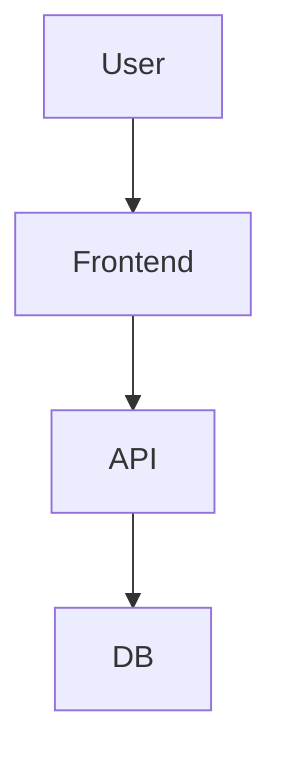
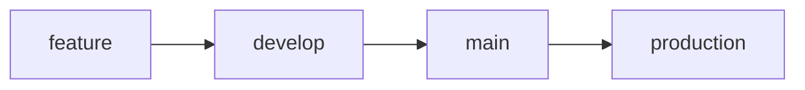

# 📦 Almacén App

<p align="center">
  <b>Sistema ERP de Inventario</b><br>
  Control de entradas, salidas y requisiciones en tiempo real
</p>

<p align="center">
  
  
  
  
  
</p>

---

## 🚀 Overview

**Almacén App** es un sistema diseñado para llevar el control total del inventario de forma rápida, intuitiva y centralizada.

- ✔ Registro ágil de movimientos
- ✔ Firma digital en salidas
- ✔ Flujo basado en requisiciones
- ✔ Reportes diarios automáticos

---

## 🧰 Tech Stack

### 🎨 Frontend

- HTML5
- TailwindCSS
- JavaScript (Vanilla)

### ⚙️ Backend

- PHP (Arquitectura modular)

### 🗄️ Base de Datos

- MySQL

### 🐳 DevOps

- Docker
- Docker Compose

---

## 🧩 Arquitectura



---

## 📂 Estructura del Proyecto

```bash
almacen-app/
│
├── modules/
│   ├── inventario/
│   ├── entradas/
│   ├── salidas/
│   └── requisiciones/
│
├── config/
│   └── database.php
│
├── docker/
├── assets/
│
└── index.php
```

---

## 🔥 Funcionalidades

### 📥 Entradas

- Registro manual o por requisición
- Control de productos recibidos

### 📤 Salidas

- Registro rápido tipo flujo manual
- Firma digital (entrega y recibe)
- Reporte diario automático (FMF-FOR-ALM-002)

### 📋 Requisiciones

- Solicitud → aprobación → entrada

### 📊 Inventario

- Consulta en tiempo real
- Búsqueda optimizada

---

## ⚡ Instalación

### 1. Clonar repositorio

```bash
git clone https://github.com/tu-repo/almacen-app.git
cd almacen-app
```

### 2. Levantar entorno

```bash
docker-compose up -d
```

### 3. Configuración

Editar archivo:

```
config/database.php
```

---

## 🌐 API (Ejemplo)

### Entradas

```
GET    /modules/entradas/
POST   /modules/entradas/
```

### Salidas

```
GET    /modules/salidas/
POST   /modules/salidas/
```

---

## 🔄 Git Flow



---

## 📏 Convenciones

| Rama       | Uso                    |
| ---------- | ---------------------- |
| main       | Versión estable        |
| develop    | Integración            |
| production | Deploy                 |
| feature/\* | Nuevas funcionalidades |

---

## 👨‍💻 Autor

**Cesar Soto**

---

## 🚧 Estado

Proyecto en evolución constante.

---

<p align="center">
  ⚡ Hecho para operar rápido. Diseñado para escalar.
</p>
